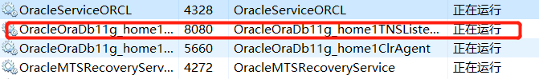
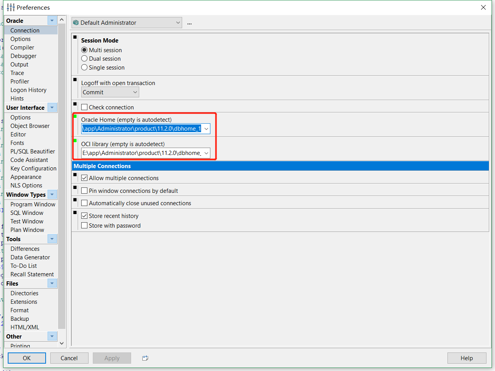

## oracle的用户名和口令

1. 默认用户有这么几个, **system,sys,scott,hr** , 一般scott 和hr 作为你的练习用户.
2. system的默认密码是 manager 
3. sys的默认密码是 change_on_install 
4. 练习用户,oracle 10g 以后需要解锁.
5. 使用sys或者system 用户登录以后,使用如下命令解锁<br>
``alter user scott identified by tiger account unlock;`` <br>
``alter user  hr  identified by  hr  account unlock;``
6. 其中scott / tiger ，hr / hr 是用户名密码。

这个口令和上述的其实还是有一点不一样的地方，就是安装Oracle的时候需要你自行定义自己的口令

## oracle数据库连接本地的plsqldeveloper进行简单的练习
安装Oracle和plsqldevelop的64位的版本
打开Oracle安装带的Net Configuration Assistant,图标是这样的<br>


打开之后做两件事：**监听程序配置** 和 **本地Net服务名配置**

### 监听程序配置的步骤


下一步


随便写一个配置文件名


启动这个监听程序

在任务管理器中看看服务启动了没有



如果是启动又闪退那就在**E:\app\Administrator\product\11.2.0\dbhome_1\NETWORK\ADMIN**这个路径上去编辑**listener.ora**文件

以下截取一下我的代码
```js
# listener.ora Network Configuration File: e:\app\Administrator\product\11.2.0\dbhome_1\network\admin\listener.ora
# Generated by Oracle configuration tools.

SID_LIST_LISTENER =
  (SID_LIST =
    (SID_DESC =
      (SID_NAME = CLRExtProc)
      (ORACLE_HOME = e:\app\Administrator\product\11.2.0\dbhome_1)
      (PROGRAM = extproc)
      (ENVS = "EXTPROC_DLLS=ONLY:e:\app\Administrator\product\11.2.0\dbhome_1\bin\oraclr11.dll")
    )
    (SID_DESC =
      (GLOBAL_DBNAME = ORCL)
      (ORACLE_HOME = e:\app\Administrator\product\11.2.0\dbhome_1)
      (SID_NAME = ORCL)
    )
  )

LISTENER =
  (DESCRIPTION_LIST =
    (DESCRIPTION =
      (ADDRESS = (PROTOCOL = IPC)(KEY = EXTPROC1521))
      (ADDRESS = (PROTOCOL = TCP)(HOST = 127.0.0.1)(PORT = 1521))
    )
  )

ADR_BASE_LISTENER = e:\app\Administrator
```

其中关键就是将HOST改成127.0.0.1,然后是加上以下这段代码
```
    (SID_DESC =
      (GLOBAL_DBNAME = ORCL)
      (ORACLE_HOME = e:\app\Administrator\product\11.2.0\dbhome_1)
      (SID_NAME = ORCL)
    )
```
### 本地Net服务名配置的步骤


下一步


随便写一个名字


主机名改成127.0.0.1


测试


测试成功


默认采用这个服务名

下一步下一步知道完成


## 打开plsqldeveloper
输入用户名scott

口令****


## 配置文件位置

 


