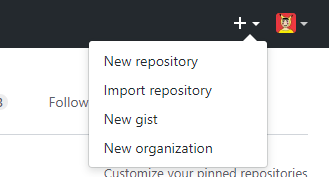
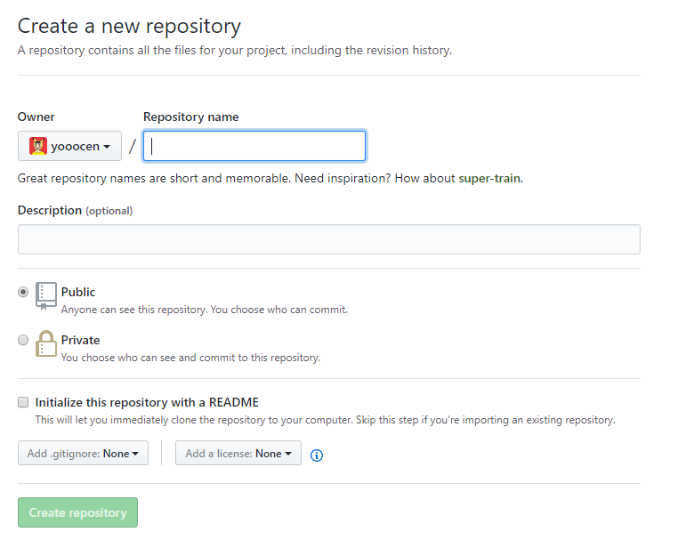
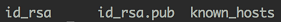
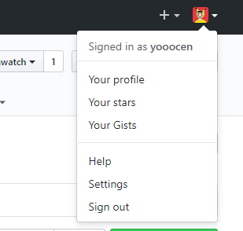
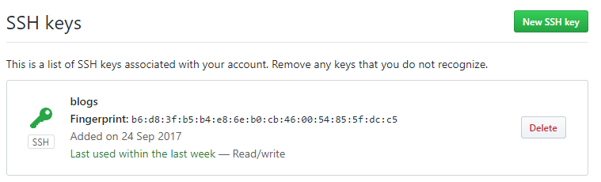
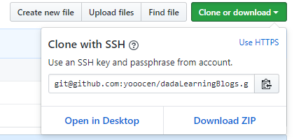

# GitHub的使用日记

>正式地开始GitHub博客生涯的第一步,本文档将讲述如何在GitHub创建一个新的仓库,如何将这个仓库克隆
>到自己的电脑上,如何在本地写伪代码和文档,并将这些东西上传到GitHub.
>让我们开始吧!

## 1.创建新的仓库

点击自己的头像(profile)左边的加号"+",点击New repository

填写新的仓库的名字和描述

## 2.设置新的SSH

首先需要安装git,具体的安装过程可以参考百度，非常的简单 

### 下面介绍在git bash中的具体指令

``$ cd ~/.ssh`` 
如果没有这个文件夹会自动生成 

``$ ssh-keygen -t rsa -C xxx@xxx.com`` 
SSH密钥生产命令,需要加上你在GitHub上注册的邮箱

``$ ls`` 
如果产生如下的结果，则已生成的SSH密钥 
 

``$ cat id_rsa.pub`` 
将产生的密钥复制到粘贴版，然后打开点击GitHub中的头像的settings
 
进入后点击SSH/CPG keys,点击new SSH key,将刚刚的密钥添加进去,结果就是下图的样子 

### 在本地设置用户名和邮箱

输入如下的指令 
``$ git config --global user.name "xxxx"`` 
``$ git config --global user.email xx@xx.com`` 
对应的就是你的名字和你的邮箱,完成后准备工作就完成啦！

## 3.clone新建的工程到本地

在GitHub上点击clone or download,要注意的是需要是途中所示的**with SSH** 复制框中的内容 

在本地新建一个文件夹,任意命名，在文件夹中打开 git bash ,输入以下的命令 

``git clone "xxxxxx"`` 

其中对应的就是上述中复制获得的内容，会生成与仓库名字相同的文件夹，在里面提交我们需要的伪代码和文档即可

